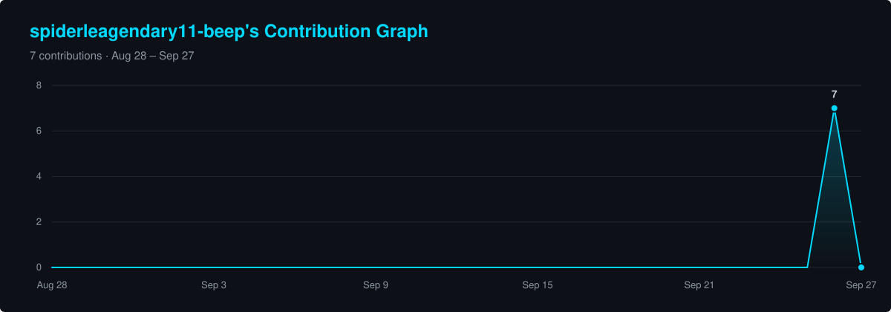

<!-- Banner -->
<p align="center">
  
</p>

<!-- Animated typing line -->
<p align="center">
  
</p>

<!-- Profile badges -->
<p align="center">
  
  
</p>


## ⚡ About Me


```python
class Developer:
    def __init__(self):
        self.username = "omchoudhari011"
        self.code = ["TypeScript", "JavaScript", "Python"]
        self.stack = ["React", "FastAPI", "React Native", "SQLite"]

    def motto(self):
        return "Ship quality, not shortcuts."
```

<br clear="right" />


## 🛠️ Tech Stack

<!-- Icon names: https://github.com/tandpfun/skill-icons#icons-list -->
<p align="center"><b>Languages</b></p>
<p align="center">
  
</p>

<p align="center"><b>Frameworks · Data</b></p>
<p align="center">
  
</p>

<p align="center"><b>Tools</b></p>
<p align="center">
  
</p>


## 📊 GitHub Stats

<p align="center">
  <!-- Generated daily by .github/workflows/stats.yml -->
  
  
</p>
<p align="center">
  
</p>


## 📈 Contribution Activity

<p align="center">
  <!-- Generated daily by .github/workflows/stats.yml (scripts/activity_graph.py) -->
  
</p>


## 🐍 Contribution Snake

<!-- Generated daily by .github/workflows/snake.yml into the "output" branch -->
<p align="center">
  <picture>
    <source media="(prefers-color-scheme: dark)" srcset="https://raw.githubusercontent.com/spiderleagendary11-beep/spiderleagendary11-beep/output/github-snake-dark.svg" />
    <source media="(prefers-color-scheme: light)" srcset="https://raw.githubusercontent.com/spiderleagendary11-beep/spiderleagendary11-beep/output/github-snake.svg" />
    
  </picture>
</p>


## 💬 Dev Quote

<p align="center">
  
</p>

<!-- Footer wave -->

